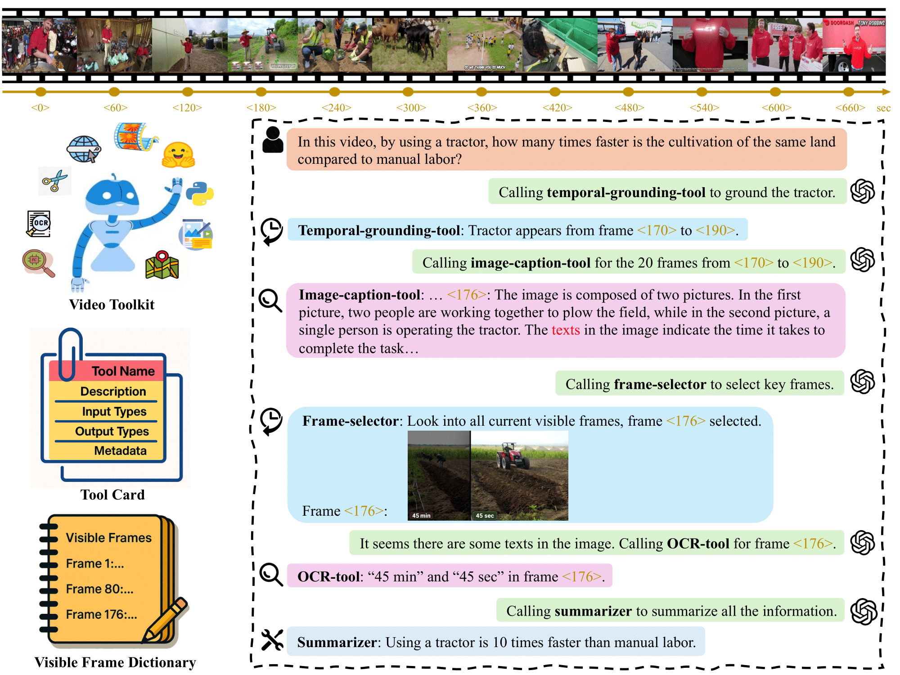

# VideoTool

[](https://lbesson.mit-license.org/)
[](https://arxiv.org/abs/2512.10359)

This repository is the official implementation of [Tool-Augmented Spatiotemporal Reasoning for Streamlining Video Question Answering Task](https://arxiv.org/abs/2512.10359) (NeurIPS 2025 main track).

## News and Todo 🗓️

- [ ] Release tools and test scripts

- [x] Release toolchain algorithm (STAR)

- [ ] Release evaluating scripts

- [ ] Clean requirements.txt

- [ ] Add more tools, e.g., audio-to-text models

## Introduction 

In this work, we equip MLLM with a comprehensive and extensible **Video Toolkit**, to enhance MLLM's spatiotemporal reasoning capabilities and ensure the harmony between the quantity and diversity of tools. To better control the tool invocation sequence and avoid toolchain shortcut issues, we propose a **Spatiotemporal Reasoning Framework (STAR)** that strategically schedules temporal and spatial tools, thereby progressively localizing the key area in the video. Our STAR framework enhances GPT-4o using lightweight tools, achieving an 8.2% gain on VideoMME and 4.6% on LongVideoBench. 




## Setup and Configuration 🛠️

1. Clone the repository 📦:
   ```python
   git clone git@github.com:fansunqi/VideoTool.git
   cd ToolChainVideo
   ```
2. Create a virtual environment 🧹 and install the dependencies 🧑‍🍳:
   ```python
   conda create -n videotool python=3.9
   conda activate videotool
   pip install -r requirements.txt
   ```
3. Set up your API key 🗝️ in `config/*.yaml`:
     ```python
     openai:
       GPT_API_KEY: "put your openai api key here"
       PROXY: "put your openai base url here"
     ```

5. Bulid related projects 🧩:
    ```python
    mkdir projects
    cd projects
    ```
   - **Download [Grounded-Video-LLM](https://github.com/WHB139426/Grounded-Video-LLM) for temporal grounding and temporal QA**

        ```python
        git clone git@github.com:WHB139426/Grounded-Video-LLM.git
        ```

        Download the [checkpoint](https://huggingface.co/WHB139426/Grounded-Video-LLM/tree/main) and specify the path in `config/*.yaml`.

   - **Build [LLaVA](https://github.com/haotian-liu/LLaVA) for image QA**

     ```python
     git clone git@github.com:fansunqi/LLaVA.git
     cd LLaVA
     pip install -e .
     cd ..
     ```


## Tools

Thanks to the authors of these open-source projects for providing excellent projects.

Temporal Tools:
- Frame Selector
    + Select frames of interest based on current information, driven by LLM.
    + Select frames of interest by image grid, driven by VLM.
- Temporal Grounding
    + Grounded-Video-LLM-7B: https://github.com/WHB139426/Grounded-Video-LLM
- Temporal Refering
    + Grounded-Video-LLM-7B: https://github.com/WHB139426/Grounded-Video-LLM
- Temporal QA
    + Grounded-Video-LLM-7B: https://github.com/WHB139426/Grounded-Video-LLM

Spatial Tools:
- Object Detection and Tracking 
    + YOLO by ultralytics: https://github.com/ultralytics/ultralytics
- Image Captioning
    + BLIP: https://huggingface.co/docs/transformers/model_doc/blip
- Image QA
    + BLIP: https://huggingface.co/docs/transformers/model_doc/blip
    + LLaVA: https://github.com/haotian-liu/LLaVA
+ Patch Zooming
    + Zoom to the key area in the images, driven by VLM. 

Generalist Tools:
- Image Grid QA
    + Image Grid QA driven by GPT-4o, adapted from https://github.com/microsoft/VLM-Video-Action-Localization
- Video QA
    + Qwen-VL-2.5-7B: https://github.com/QwenLM/Qwen2.5-VL
- Summarizer
    + Summarize all currect information, driven by LLM.


## Tools Testing
See [```tools/test_tools.sh```](https://github.com/fansunqi/VideoTool/blob/main/tools/test_tools.sh)

## Usage
Run with single video:
```
python run_single_video.py \
    --config config/star_single_video.yaml \
    --video_path /path/to/video.mp4 \
    --question "What is happening in the video?"
```

Run with single video and options
```
python run_single_video.py \
    --config config/star_single_video.yaml \
    --video_path /path/to/video.mp4 \
    --question "What is the person doing?" \
    --options "A. Running" "B. Swimming" "C. Cooking"
```

Run testcases (testcases can be found in ```testcases``` directory.):
```
bash run_testcases.sh
```


## Download Datasets
- NeXT-QA：
  ```
  git clone git@github.com:doc-doc/NExT-QA.git
  ```
  specify your data path in ```config/nextqa.yaml```


## Evaluation


## Acknowledgments
We thank the developers of [OctoTools](https://octotools.github.io/) and all developers of the open-source projects we used. 

## Citation
If you find our repo useful, please kindly consider citing:

```
@inproceedings{
    fan2025toolaugmented,
    title={Tool-Augmented Spatiotemporal Reasoning for Streamlining Video Question Answering Task},
    author={Sunqi Fan and Jiashuo Cui and Meng-Hao Guo and Shuojin Yang},
    booktitle={The Thirty-ninth Annual Conference on Neural Information Processing Systems},
    year={2025},
    url={https://openreview.net/forum?id=OFz4VDn0SO}
}
```